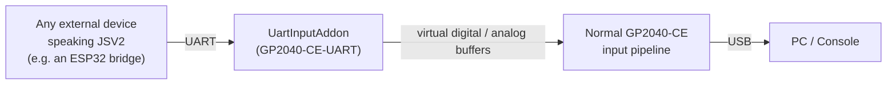

# GP2040-CE-UART

[](https://opensource.org/licenses/MIT)
[](https://github.com/Jamaica-Sound/GP2040-CE-UART)
[](https://github.com/OpenStickCommunity/GP2040-CE)
[](https://github.com/Jamaica-Sound/GP2040-CE-UART/wiki)

This is a fork of **[GP2040-CE](https://github.com/OpenStickCommunity/GP2040-CE)**, the open-source input firmware for the Raspberry Pi Pico (RP2040) that adds a **UART serial input addon**, letting the Pico receive digital buttons, analog stick values, Hall-Effect trigger data and rotary-encoder input from **any external device over a plain serial link**, merged seamlessly into the normal GP2040-CE input pipeline.

> **Status:** actively developed and functional for its core use case digital buttons, analog sticks, Hall-Effect trigger and rotary-encoder routing over UART all work. The dedicated **UART Inputs Configuration** web page works, but it is still a **work-in-progress**: a few controls are visibly present but not yet wired to real functionality (multi-profile mapping, the pin auto-map buttons, remote display forwarding). The Italian localization added by this fork is also partial. See the [Wiki](https://github.com/Jamaica-Sound/GP2040-CE-UART/wiki) for the full, code-verified breakdown of what works today.

## Table of Contents

- [How It Works](#how-it-works)
- [Protocol Overview](#protocol-overview)
- [Key Characteristics](#key-characteristics)
- [Any Device, Not Just the ESP32 Companion Project](#any-device-not-just-the-esp32-companion-project)
- [Software Requirements](#software-requirements)
- [Quick Start](#quick-start)
- [Configuration](#configuration)
- [Documentation / Wiki](#documentation--wiki)
- [Roadmap](#roadmap)
- [Contributing](#contributing)
- [Support](#support)
- [License](#license)
- [Credits](#credits)

## How It Works



`UartInputAddon` opens UART0 on two configurable GPIOs, parses incoming packets, and exposes the decoded state as a **virtual GPIO mask**. The core input loop transparently substitutes these virtual values in place of the real electrical reading for any GPIO you've mapped in the UART Addon Webpage, any GPIO not mapped in the webpage is left untouched. This means you can mix real GPIOs with virtual ones in your controller configuration.This is a **transparent replacement**, everything downstream (debounce, SOCD cleaning, button-to-action mapping, USB HID reporting) works exactly as it would with or without real physically wired hardware.

## Protocol Overview

The addon speaks **JSV2**, a small binary protocol defined in [`protocol_v2.h`](https://github.com/Jamaica-Sound/Esp32-lowlatency-wireless-gp2040ce-controller/blob/main/Controller/protocol_v2.h):

- **CONFIG packets** (`type 0x01`) declare how many digital/analog channels the sender will report, and their pin identifiers (up to 64 each). They must be sent at least once per session (be sure it is received and correctly parsed), and as soon as possible (in my configuration the are sent once every second just to be sure they are received early in the session, the generated traffic is risible).
- **RUNTIME packets** (`type 0x02`) carry the live state of a 64-bit digital bitmask plus one 16-bit value per declared analog channel. They are sent as fast as possible to ensure the best latency.
- Every packet starts with a `0x534A` sync word and ends with a **CRC16** (poly `0x1021`, init `0xFFFF`); anything that fails the checksum is silently discarded.

Full byte-level breakdown: [UART Communication Protocol](https://github.com/Jamaica-Sound/GP2040-CE-UART/wiki/UART-Communication-Protocol).

## Key Characteristics

- **Generic virtual-GPIO override** — up to 30 configurable `physical GPIO ↔ virtual pin` mappings; a mapped GPIO's electrical reading is fully replaced by the UART-sourced value. All configuration (including action assignment) is available here, so you don't need to use the original GPIO Pin Mapping page, which will still reflect any changes. See [Virtual GPIO Mapping](https://github.com/Jamaica-Sound/GP2040-CE-UART/wiki/Virtual-GPIO-Mapping).
- **Cross-addon routing** — the Analog, Hall-Effect Trigger and Rotary Encoder addons can each source individual GPIOs from the UART virtual buffers instead of real hardware. Each addon reads from UART only for the specific GPIOs that are both (a) present in the mapping table and (b) have that addon's own switch enabled — any GPIO not in the mapping table always reads real hardware, so mixing a physically wired stick with a UART-fed one on the same addon is fully supported. See [Addon Integration](https://github.com/Jamaica-Sound/GP2040-CE-UART/wiki/Addon-Integration).
- **Two connection modes** — a "trust mode" for pre-agreed manual fixed configurations or an automatic text-based handshake/baud-negotiation sequence for first-time pairing. See [Handshake and Connection](https://github.com/Jamaica-Sound/GP2040-CE-UART/wiki/Handshake-and-Connection).
- **Runtime-configured, not compile-time** — the addon is always compiled in and does nothing until enabled through the web configurator or its REST API, so a single firmware build works with or without a UART sender attached.

## Any Device, Not Just the ESP32 Companion Project

This firmware was built to pair with **[Esp32-lowlatency-wireless-gp2040ce-controller](https://github.com/Jamaica-Sound/Esp32-lowlatency-wireless-gp2040ce-controller)**, a companion project that bridges two ESP32 boards over ESP-NOW to this Pico's UART, but the addon itself only cares about receiving valid JSV2 bytes on its RX pin. **Any microcontroller or device that implements the same packet structs, sync word and CRC16 can drive it**, whether that's a different MCU wired directly to the Pico, a PC with a USB-UART adapter, or your own custom sender built around [`protocol_v2.h`](https://github.com/Jamaica-Sound/Esp32-lowlatency-wireless-gp2040ce-controller/blob/main/Controller/protocol_v2.h). See [Interaction with the ESP32 Companion Project](https://github.com/Jamaica-Sound/GP2040-CE-UART/wiki/Interaction-with-the-ESP32-Companion-Project) for the exact boundary between "generic protocol" and "ESP32-project-specific behavior".

## Software Requirements

Same toolchain as upstream GP2040-CE:

- CMake + the `arm-none-eabi` GCC toolchain
- `pico-sdk` (pulled in as a submodule)
- Node.js + npm, only if you intend to modify the web configurator (`www/`)

## Quick Start

Download the latest release available at: https://github.com/Jamaica-Sound/GP2040-CE-UART/releases/latest or compile it from source:

```bash
git clone --recursive https://github.com/Jamaica-Sound/GP2040-CE-UART.git
cd GP2040-CE-UART
mkdir build && cd build
cmake .. -DGP2040_BOARDCONFIG=Pico
make -j$(nproc)
```
### Important note for webconfig configuration:

After flashing the main firmware to the Pico, the serial input may not be available immediately at boot. This means the button combination required to access the web configuration page might not be recognized.
To perform the initial configuration without pressing any button, you need to flash an additional small file right after the main firmware. This file forces the device to enter web configuration mode on the next reboot.
You can download the file force_webconfig.uf2 from the releases section of the original upstream repository:
https://github.com/OpenStickCommunity/GP2040-CE/releases/download/v0.7.12/force_webconfig.uf2

1. Flash the resulting `GP2040-CE-UART_X.X.XX.uf2` onto your Pico in BOOTSEL mode (press BOOTSEL, connect USB, copy the file).
2. Immediately after, flash `force_webconfig.uf2` using the same method. The Pico will reboot and automatically enter web configuration mode.
3. Open the web configurator and go to **UART Inputs Configuration**.
4. Enable the addon, Set **TX Pin** / **RX Pin** to match your wiring.
5. If pairing with the ESP32 companion project (or any sender implementing the handshake), enable **Auto-Handshake**; otherwise choose from the list a fixed **baudrate** on both ends and **Save**.

Full walkthrough: [Installation and Setup](https://github.com/Jamaica-Sound/GP2040-CE-UART/wiki/Installation-and-Setup).

## Configuration

Every setting lives under `uartOptions` in the stored configuration and is editable from the **UART Inputs Configuration** web page (or directly via its REST endpoints).

| Field | Default | Purpose |
|---|---|---|
| `enabled` | `false` | Master switch for the addon |
| `baudRate` | `115200` | UART speed once the link is established, 921600 or higher is reccomended for best latency |
| `txPin` / `rxPin` | unset | Physical UART GPIOs — required for the addon to start |
| `autoHandshakeEnabled` | `false` | Run the automatic pairing sequence instead of "trust mode" |
| `mappingEnabled` + `mappings[30]` | off / unset | The `gpio ↔ virtualPin` table |
| `analogEnabled` / `he_triggerEnabled` / `rotaryencoderEnabled` | `false` | Per-addon UART routing switches — each also requires the specific GPIO to be present in `mappings` before that addon actually reads from UART |
| `remoteDisplayEnabled` | `false` | WIP, UI-only today — see the Wiki |

Full field-by-field and REST API reference: [Configuration Reference](https://github.com/Jamaica-Sound/GP2040-CE-UART/wiki/Configuration-Reference).

## Documentation / Wiki

This README covers the essentials. The project [**Wiki**](https://github.com/Jamaica-Sound/GP2040-CE-UART/wiki) is a full, code-verified reference.

| Page | Content |
|---|---|
| [Architecture Overview](https://github.com/Jamaica-Sound/GP2040-CE-UART/wiki/Architecture-Overview) | Where the addon sits in GP2040-CE, high-level data flow |
| [Installation and Setup](https://github.com/Jamaica-Sound/GP2040-CE-UART/wiki/Installation-and-Setup) | Building, flashing, enabling the addon |
| [UART Communication Protocol](https://github.com/Jamaica-Sound/GP2040-CE-UART/wiki/UART-Communication-Protocol) | The JSV2 packet format, CRC16, packet types |
| [Handshake and Connection](https://github.com/Jamaica-Sound/GP2040-CE-UART/wiki/Handshake-and-Connection) | Trust mode vs. the automatic pairing sequence |
| [Virtual GPIO Mapping](https://github.com/Jamaica-Sound/GP2040-CE-UART/wiki/Virtual-GPIO-Mapping) | How the 30-entry mapping table overrides physical GPIOs |
| [Addon Integration](https://github.com/Jamaica-Sound/GP2040-CE-UART/wiki/Addon-Integration) | How Analog, HE Trigger and Rotary Encoder consume UART data |
| [Interaction with ESP32 Companion Project](https://github.com/Jamaica-Sound/GP2040-CE-UART/wiki/Interaction-with-ESP32-Companion-Project) | The reference use case, and generic third-party device support |
| [UART Web Configurator](https://github.com/Jamaica-Sound/GP2040-CE-UART/wiki/UART-Web-Configurator) | Full page walkthrough, including what's still WIP |
| [Configuration Reference](https://github.com/Jamaica-Sound/GP2040-CE-UART/wiki/Configuration-Reference) | Every field and REST endpoint |
| [Italian Localization](https://github.com/Jamaica-Sound/GP2040-CE-UART/wiki/Italian-Localization) | What's translated, what isn't |
| [Troubleshooting](https://github.com/Jamaica-Sound/GP2040-CE-UART/wiki/Troubleshooting) | Common problems and how to read status messages |
| [Roadmap, Contributing and License](https://github.com/Jamaica-Sound/GP2040-CE-UART/wiki/Roadmap-Contributing-and-License) | Project status and contribution guidelines |

## Roadmap

- Finish wiring up multi-profile pin mapping in the web configurator.
- Implement actual display-data forwarding behind the "Enable Remote Display" toggle.
- Complete the Italian translation (24 of 27 UI locale files remain).
- Firm up the GPIO/baud auto-detect path, or replace it with a more reliable discovery mechanism.

## Contributing

Issues and pull requests are welcome. See [Roadmap, Contributing and License](https://github.com/Jamaica-Sound/GP2040-CE-UART/wiki/Roadmap-Contributing-and-License) for suggested areas to start from.

## Support

For questions or issues, please [open an issue](https://github.com/Jamaica-Sound/GP2040-CE-UART/issues) on this repository.

## License

Licensed under the [MIT License](https://github.com/Jamaica-Sound/GP2040-CE-UART/blob/main/LICENSE), inherited from upstream GP2040-CE (© OpenStickCommunity, © Jason Skuby).

## Credits

- **Author:** Jamaica Sound
- Built on top of the [GP2040-CE](https://github.com/OpenStickCommunity/GP2040-CE) project by OpenStickCommunity
- Designed to pair with the [Esp32-lowlatency-wireless-gp2040ce-controller](https://github.com/Jamaica-Sound/Esp32-lowlatency-wireless-gp2040ce-controller) companion project
